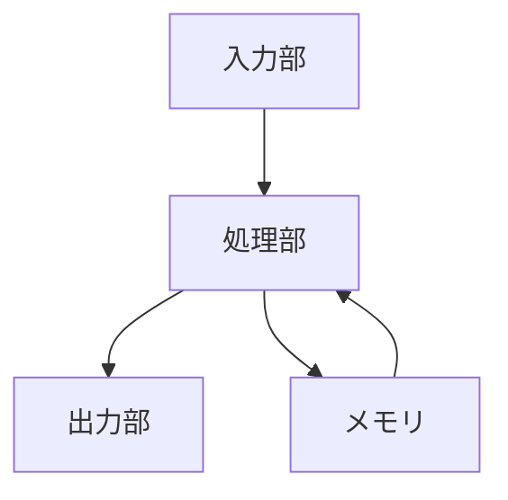
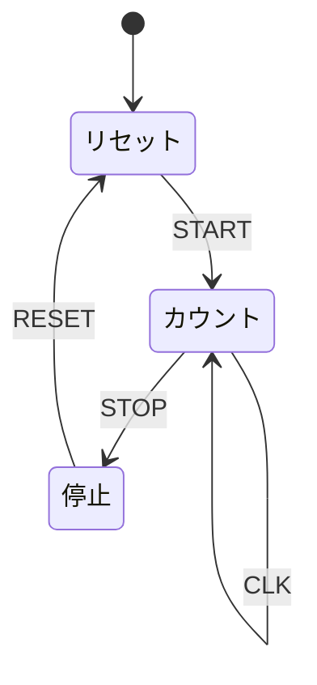

# 学習モードダイアグラムレンダリング手法の比較検討

## 概要
学習モードで必要な各種ダイアグラムに対して、最適なレンダリング手法を検討する。

## ダイアグラムの種類と推奨手法

### 1. 回路図（Circuit Diagrams）

#### 推奨: **既存のCanvas要素を活用**
- **理由**: 
  - すでに高品質な回路図レンダリングシステムが実装済み
  - インタラクティブ性（ホバー、クリック）が実現可能
  - 実際の回路シミュレーションと連携可能
- **実装方法**:
  ```tsx
  // 既存のCanvas, Gate, Wireコンポーネントを読み取り専用モードで使用
  <Canvas readOnly={true} circuit={lessonCircuit} />
  ```

### 2. 信号波形図（Waveform Diagrams）

#### 推奨: **SVG + D3.js または専用ライブラリ**
- **理由**:
  - 時間軸と電圧軸の正確な表現が必要
  - アニメーション対応が重要
  - 複数信号の同期表示が必須
- **候補ライブラリ**:
  - WaveDrom（デジタル波形専用）
  - D3.js（汎用的、カスタマイズ性高）
  - Chart.js（シンプル、学習コスト低）

#### 例: アナログ vs デジタル信号の比較
```tsx
// WaveDromを使用した例
const analogVsDigital = {
  signal: [
    { name: "アナログ", wave: "smooth", data: [0, 2.5, 5, 2.5, 0] },
    { name: "デジタル", wave: "01010" }
  ]
};
```

### 3. ブロック図・システム図

#### 推奨: **Mermaid.js**
- **理由**:
  - 宣言的な記述で保守性が高い
  - 階層構造の表現が得意
  - 自動レイアウト機能
- **実装例**:


### 4. 真理値表（Truth Tables）

#### 推奨: **HTML/CSS Table**
- **理由**:
  - シンプルで確実
  - アクセシビリティ対応が容易
  - レスポンシブ対応が簡単
- **改善案**:
  - 現在の実装に視覚的な強調（ハイライト）を追加
  - インタラクティブな行選択機能

### 5. タイミングチャート

#### 推奨: **WaveDrom または カスタムSVG**
- **理由**:
  - デジタル回路の標準的な表現方法
  - クロックエッジの正確な表現が必要
  - 信号間の関係性を明確に表示
- **実装例**:
```javascript
{
  signal: [
    { name: "CLK",  wave: "p....." },
    { name: "D",    wave: "x.1.0.", data: ["", "1", "0"] },
    { name: "Q",    wave: "x.1..0", data: ["", "1", "0"] }
  ]
}
```

### 6. 状態遷移図

#### 推奨: **Mermaid.js（stateDiagram）**
- **理由**:
  - 状態遷移の標準的な記法をサポート
  - 自動レイアウト
  - 条件分岐の表現が容易
- **実装例**:


### 7. データフロー図

#### 推奨: **React Flow**
- **理由**:
  - ノードベースの表現に最適
  - データの流れを視覚的に表現
  - カスタムノードの作成が容易
  - インタラクティブ性（パン、ズーム）

## 実装アプローチ

### Phase 1: 既存資産の活用
1. 回路図 → 既存のCanvasコンポーネント
2. 真理値表 → 既存のHTMLテーブルを改善

### Phase 2: 新規ライブラリの導入
1. 波形図・タイミングチャート → WaveDrom
2. ブロック図・状態遷移図 → Mermaid.js

### Phase 3: 高度な視覚化
1. データフロー図 → React Flow
2. カスタムアニメーション → Framer Motion

## 統合戦略

```tsx
// 統一されたダイアグラムレンダラー
interface DiagramRenderer {
  type: 'circuit' | 'waveform' | 'block' | 'table' | 'timing' | 'state' | 'flow';
  render(data: any): JSX.Element;
}

// ファクトリーパターンで適切なレンダラーを選択
class DiagramFactory {
  static create(type: DiagramType): DiagramRenderer {
    switch(type) {
      case 'circuit': return new CircuitDiagramRenderer();
      case 'waveform': return new WaveformRenderer();
      case 'block': return new MermaidRenderer();
      // ...
    }
  }
}
```

## 利点と課題

### 利点
- 各ダイアグラムタイプに最適な表現方法を選択
- 既存資産を最大限活用
- 段階的な実装が可能
- 保守性とパフォーマンスのバランス

### 課題
- 複数のライブラリによる依存関係の増加
- バンドルサイズの増大
- 統一的なスタイリングの必要性
- 学習コストの増加

## 結論

ASCIIアートから脱却し、各ダイアグラムタイプに最適なレンダリング手法を採用することで、学習体験を大幅に向上させることができる。特に：

1. **回路図**: 既存のCanvasシステムを活用（最高品質）
2. **波形・タイミング**: WaveDrom（業界標準）
3. **構造図**: Mermaid.js（宣言的で保守性高）
4. **データフロー**: React Flow（インタラクティブ）

この多層的アプローチにより、各種ダイアグラムを最適な形で表現できる。